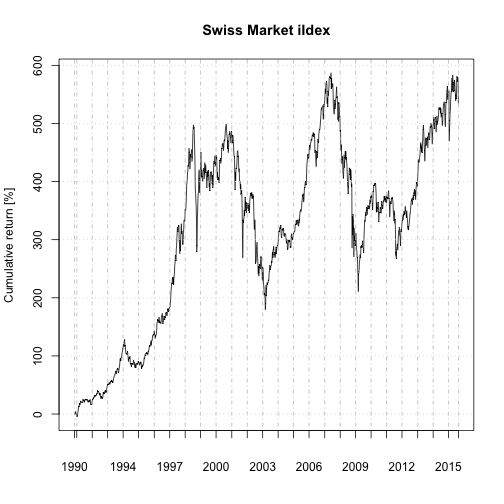

Swiss ETF Tool
========================================================
author: Manuel Walser
date: August 2015
font-family: 'Verdana'

Demo: https://higgser.shinyapps.io/swissetf

The Idea
========================================================

- Web Application to compare Swiss ETFs
- Application tailored to Swiss market
- ETF = Exchange Traded Funds
- Simple and cost-efficient for private investors
- SMI = Swiss market index

The Data Source
========================================================

- Data is loaded from [Quandl.com](http://www.quandl.com)
- Only public free series are used
- Data quality is problematic
- Missing and wrong data mess up the plots
- Most Swiss instruments are missing
- Results from Google/Yahoo with quantmod not better

Cumulative Return
========================================================

$R_t$ = aggregated profit/loss = $\frac{P_t - P_0}{P_0} 100 \%$

 

Outlook and Improvements
========================================================
incremental: true

- Include more ETFs
- Compare againts other indices (SMIM, SPI, SLI, ...)
- Show selectable table with all ETFs
- Show summary of each ETF
- Calcuate more performance indicators (volatility, TER, ...)
- Rate financial instruments
